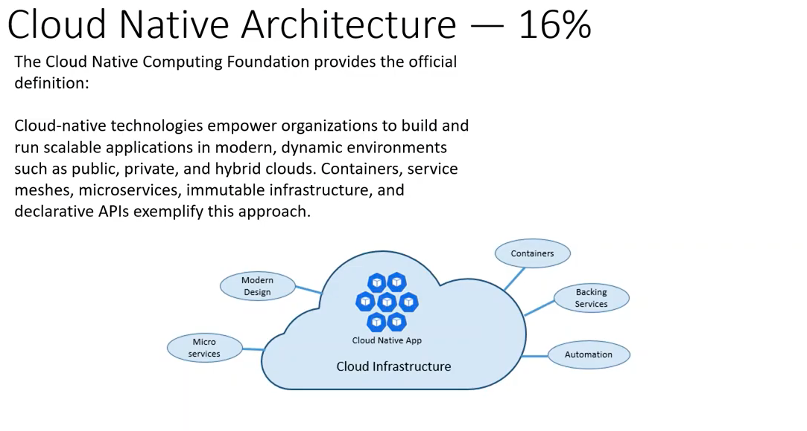

# Extra

## CI/CD

### Continuous Integration

L'intégration du code de chaque participant à la codebase afin d'éviter les problèmes de merge et s'assurer que le projet compile encore. On peut s'assurer de cela en faisant des pull request, automatiser des build-check et des tests.

### Continuous Deployment(Delivery)
It's set of step that automate the moment where developper increment something with his code to end up in production. It can goes somewhere along these step

- Code
- Code Review
- QA/testing
- Staging
- Preview (blue/green or canary)
- Production

L'automatiser à 100% est assez extrême comme pratique, la plupart du temps, il va y avoir une approbation nécessaire avant d'aller en production, et c'est ce qui va faire la différence entre "continuous delivery" (avec approbation) et "continuous deployment" (100% automatisé)

## GitOps

Traiter Infrastructure as code done comme n'importe quel code d'application avec de PR des versions contrôlées, une CI pipeline qui va tester et une approbation avant de merger. Il vont agir en pull deployment : Il y a un état actuel de déployé sur les clusters, lors d'un déploiement on compare l'état désiré avec l'état actuel et on applique les changements s'il y en a.

## Site Reliability Enginering (SRE)

Un mélange entre les IT et les DevOps. Ils vont passer 50% de leur temps à régler les problèmes de clients et l'autre 50% à automatiser ce qu'ils font. Ils peuvent être sur appel, ils vont comprendre l'en.semble du projet sur lequel ils travaillent, hardware, fonctionnement etc. Ils savent comment les clients utilisent le produit, assume la loi de Murphy

## Cloud native architecture

## CRI Container Runtime Interface

Il fait du push/pull et de la supervisionn de conteneurs, il ne les créer pas et ne les roulent pas. Open Container initiative runtime va s'occuper de les rouler.
2 populaires sont Containerd et CRI-O, Docker ne l'implémente pas.

## CNI Container Networking Interface

C'est un cadriciel écrit en Go qui sert à configurer les ressources réseaux. Il va aider à maintenir une connection avec plusieurs hôtes.

## Container Storage Interface (CSI)

## Service Mesh

C'est une façon de contrôler la manière que différents micro-services d'une application partagent des données entre eux. Il est créé directement dans l'application. Pour satisfaire un à la demande d'un utilisateur, plusieurs services peuvent être demandé en même temps et vont être dépendant l'un de l'autre pour acheminer le résultat. Le service mesh va acheminer les demandes d'un service au suivant de manière à optimiser le tout. Ces deux principales composantes sont le control plane et le data plane.

## RBAC (Role based access control)

Il est responsable des autorisations et décide ce que le demandeur peut avoir accès dans les ressources.

## Container Orchestrator Systems

Sert à automatiser les déploiement, la gestion et la mise à l'échelle de containers. Exemple :

- Kubernetes
- Apache Mesos
- Docker Swarm
