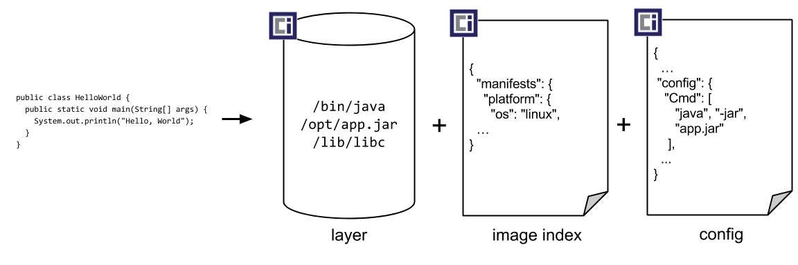

# Kubernetes and Cloud Native Essentials (LFS250) - FOR KCNA CERTIFICATE

## 01. COURSE INTRODUCTION
- Cloud Native Computing Foundation (CNCF) is an open source software foundation under the Linux Foundation umbrella dedicated to making cloud native computing universal and sustainable.

Certification :
> You can take your certification exam from any computer, anywhere, at any time.
> The certification exams are either performance-based​ or multiple choice.
> The exams are distribution-flexible.
> The exams are up-to-date, testing knowledge and skills that actually matter in today's IT environment.


## 02. CLOUD NATIVE ARCHITECTURE


### Cloud Native Architecture Fundamentals
Cloud native architecture can provide solutions for the increasing complexity of applications and the growing demand by users. The basic idea is to break down your application in smaller pieces which makes them more manageable. Monolithic to Microservices Architecture


### Characteristics of Cloud Native Architecture
1. High level of automation : Automation is recommended in every step from development to deployment to manage all the moving parts of your cloud native application
2. Self healing : Include health checks which help monitor your application from the inside and automatically restart them if necessary
3. Scalable : Scaling your application describes the process of handling more load while still providing a pleasant user experience
4. (Cost-) Efficient : A way to optimize your infrastructure usage
5. Easy to maintain : Using Microservices allows to break down applications in smaller pieces and make them more portable, easier to test and to distribute across multiple teams.
6. Secure by default : Cloud environments are often shared between multiple customers or teams, which calls for different security models. Patterns like zero trust computing mitigates that by requiring authentication from every user and process.

Guideline for developing cloud native application -> https://12factor.net/


### Autoscaling
The autoscaling pattern describes the dynamic adjustment of resources based on the current demand.

`Horizontal scaling` (most common) : the process of spawning new compute resources which can be new copies of your application process, virtual machines, or - in a less immediate way - even new racks of servers and other hardware.

`Vertical scaling` : the change in size of the underlying hardware, which only works within certain hardware limits for bare metal, but also for virtual machines -> more RAM, CPU and memory

    ILLUSTRATION : imagine that you have to carry a heavy object that you cannot pick up. You can build muscle to carry it yourself, but your body has an upper limit of strength. That's vertical scaling. You can also call your friends and ask them to help you and share the work. That's horizontal scaling.


Configuring autoscaling in various environments requires configuring a minimum and maximum limit of instances (virtual machines or containers) and a metric that triggers the scaling.


### Serverless
Contrary to what the term "serverless" suggests, servers are of course still required as the basis for your applications. The idea of serverless computing is to relieve developers of these complicated tasks. In a nutshell, you can just provide the application code, while the cloud provider chooses the right environment to run your application.

`FaaS` (Function as a Service) : The cloud provider abstracts the underlying infrastructure, so that developers can deploy software by uploading their code for example as .zip files or providing a container image.

In contrast to other cloud computing models, serverless computing has an even stronger focus on the on-demand provisioning and scaling of applications. `ONLY PAY FOR WHAT YOU USE!`


### Open Standards
Many cloud native technologies rely heavily on open source software.

A common problem is how to build and distribute software packages, since applications have a lot of requirements and dependencies for the underlying operating system and the application runtime. To overcome this problem, containers evolved as a standardized way to package and ship modern software.

Open standards:
- Open Container Initiative (OCI) Spec: image, runtime and distribution specification on how to run, build an distribute containers
- Container Network Interface (CNI): A specification on how to implement networking for Containers.
- Container Runtime Interface (CRI): A specification on how to implement container runtimes in container orchestration systems.
- Container Storage Interface (CSI): A specification on how to implement storage in container orchestration systems.
- Service Mesh Interface (SMI): A specification on how to implement Service Meshes in container orchestration systems with a focus on Kubernetes.


### Cloud Native Roles & Site Reliability Engineering
- Cloud Architect : Responsible for adoption of cloud technologies, designing application landscape and infrastructure, with a focus on security, scalability and deployment mechanisms.
- DevOps Engineer : use tools and processes that balance out software development and operations. Starting with approaches to writing, building, and testing software throughout the deployment lifecycle.
- Security Engineer : Cloud technologies have created new attack vectors and these days the role has to be lived much more inclusive and as an integral part of a team.
- DevSecOps Engineer : In an effort to make security an integral part of modern IT environments, the DevSecOps Engineer combines the roles of the previous two. This role is often used to build bridges between more traditional development and security teams.
- Data Engineer : Data engineers face the challenge of collecting, storing, and analyzing the vast amounts of data that are being or can be collected in large systems. This can include provisioning and managing specialized infrastructure, as well as working with that data.
- Full-Stack Developer : An all-rounder who is at home in frontend and backend development, as well as infrastructure essentials.
- Site Reliability Engineer (SRE) : The overarching goal of SRE is to create and maintain software that is reliable and scalable. To achieve this, software engineering approaches are used to solve operational problems and automate operation tasks. Based on 3 metrics :
  - Service Level Objectives (SLO),
  - Service Level Indicators (SLI)
  - Service Level Agreements (SLA).


### Community and Governance
The Cloud Native Computing Foundation (CNCF) has a Technical Oversight Committee (TOC) that is responsible for defining and maintaining the technical vision, approving new projects, accepting feedback from the end-user committee, and defining common practices that should be implemented in CNCF projects.


## 03. CONTAINER ORCHESTRATION


### Use of Containers
While the developer knows his application and its dependencies best, it is usually a system administrator who provides the infrastructure, installs all of the dependencies, and configures the system on which the application runs.

Containers can be used for managing the dependencies of an application and running much more efficiently than spinning up a lot of virtual machines.


### Container Basics
One of the earliest ancestors of modern container technologies is the chroot command that was introduced in Version 7 Unix in 1979.
 * Chroot directories can be created on various places in the filesystem


#### Namespace - The Linux Kernel 5.6 currently provides 8 namespaces
* pid - process ID provides a process with its own set of process IDs.
* net - network allows the processes to have their own network stack, including the IP address.
* mnt - mount abstracts the filesystem view and manages mount points.
* ipc - inter-process communication provides separation of named shared memory segments.
* user - provides process with their own set of user IDs and group IDs.
* uts - Unix time sharing allows processes to have their own hostname and domain name.
* cgroup - a newer namespace that allows a process to have its own set of cgroup root directories. Used to organize processes in hierarchical groups and assign them resources like memory and CPU. When you want to limit your application container to let’s say 4GB of memory, cgroups are used under the hood to ensure these limits.
* time - the newest namespace can be used to virtualize the clock of the system.

#### Docker
Launched in 2013, `Docker` became synonymous with building and running containers. Although Docker did not invent the technologies that are used to run containers, they stitched together existing technologies in a smart way to make containers more user friendly and accessible.

#### Containers are very different to virtual machines
While virtual machines emulate a complete machine, including the operating system and a kernel, `containers share the kernel of the host machine` and, as explained, are only isolated processes.

`But, the usage of containers and virtual machines ARE NOT mutually exclusive`


- Containers are literally processes while virtual machines come with some overhead, be it boot time, size or resource usage to run the operating system

### Running Containers

To run industry-standard containers, you don't need to use Docker; you can just follow the [OCI runtime-spec standard](https://github.com/opencontainers/runtime-spec) instead.

Podman is equivalent to Docker.

* If you're a developer and you know about object-oriented programming, you can imagine the relationship between the container image and the running container like a class and the instantiation of that class.

To start containers : `docker run nginx:1.20`


### Building Container Images
A Docker container image is a lightweight, standalone, executable package of software that includes everything needed to run an application: code, runtime, system tools, system libraries and settings.

#### Container Images
`Images` can be built by reading the instructions from a buildfile called `Dockerfile`.



To build a image : `docker build -t <image_name_tag> -f <path_to_Dockerfile>`

To distribute these images, you can use a container registry.
`docker push my-registry.com/<image_name_tag>`
`docker pull my-registry.com/<image_name_tag>`


### Security
`Containers` have different security requirements than virtual machines.

When containers are started on a machine, they always share the same kernel, which then becomes a risk for the whole system, if containers are allowed to call kernel functions like for example killing other processes or modifying the host network by creating routing rules.

One of the greatest security risks, not only in the container area, is the execution of processes with too many privileges, especially starting processes as root or administrator.

4 layers of security : cloud ( cluster ( container ( code ) ) )

See this for more details : ttps://sysdig.com/blog/dockerfile-best-practices/


### Container Orchestration Fundamentals
If you have to manage and deploy large amounts of containers, you quickly get to the point where you need a system that helps with the management of these containers. Problems to be solved can include:
* Providing compute resources like virtual machines where containers can run on
* Schedule containers to servers in an efficient way
* Allocate resources like CPU and memory to containers
* Manage the availability of containers and replace them if they fail
* Scale containers if load increases
* Provide networking to connect containers together
* Provision storage if containers need to persist data.

`Container orchestration` (like Kubernetes) systems provide a way to build a cluster of multiple servers and host the containers on top. Most container orchestration systems consist of two parts:
1. a control plane that is responsible for the management of the containers
2. worker nodes that actually host the containers.


### Networking
Microservice architecture depends heavily on network communication.

`Network namespaces` allow each container to have its own unique IP address. therefore multiple applications can open the same network port; for example, you could have multiple containerized web servers that all open port 8080.

To make the application accessible from outside the host system, containers have the ability to map a port from the container to a port from the host system.

To allow communication between containers across hosts, we can use an overlay network which puts them in a virtual network that is spanned across the host systems.


Most modern implementations of container networking are based on the `Container Network Interface (CNI)`


### Service Discovery & DNS
Instead of having a manually maintained list of servers (or in this case containers), all the information is put in a Service Registry. Finding other services in the network and requesting information about them is called Service Discovery.

#### DNS
Modern DNS servers that have a service API can be used to register new services as they are created. This approach is pretty straightforward, as most organizations already have DNS servers with the appropriate capabilities.

#### Key-Value-Store
Using a strongly consistent datastore especially to store information about services. A lot of systems are able to operate highly available with strong failover mechanisms. Popular choices, especially for clustering, are etcd, Consul or Apache Zookeeper.


### Service Mesh
Because the networking is such a crucial part of microservices and containers, the networking can get very complex and opaque for developers and administrators and a lot of functionality like monitoring, access control or encryption of the networking traffic is desired when containers communicate with each other.

Instead of implementing all of this functionality into your application, you can just start a second container that has this functionality implemented. The software you can use to manage network traffic is called a proxy.

Popular representatives are `nginx`


You can now use the proxies to handle network communication between your services.

When a `service mesh` is used, applications don’t talk to each other directly, but the traffic is routed through the proxies instead. The most popular service meshes at the moment are `istio` and `linkerd`.

The proxies (nginx) in a service mesh (linkerd) form the `data plane`. This is where networking rules are implemented and shape the traffic flow. These rules are managed centrally in the `control plane` of the service mesh. This is where you define how traffic flows from service A to service B and what configuration should be applied to the proxies.


### Storage

From a storage perspective, containers have a significant flaw: they are `ephemeral`. Generally speaking, container images are read-only and consist of different layers that include everything that you added during the build phase. That ensures that every time you start a container from an image you get the same behavior and functionality.

To allow writing files, a read-write layer is put on top of the container image when you start a container from an image. The problem here is that this read-write layer is lost when the container is stopped or deleted.


Container orchestration systems like Kubernetes can help to mitigate these problems, but always require a robust storage system that is attached to the host servers. Storage is provisioned via a central storage system. Containers on Server A and Server B can share a volume to read and write data

In order to keep up with the unbroken growth of various storage implementations, again, the solution was to implement a standard. The `Container Storage Interface (CSI)` came up to offer a uniform interface which allows attaching different storage systems no matter if it’s cloud or on-premises storage.


## 04. KUBERNETES FUNDAMENTALS
Kubenretes : Originally designed and develop by Google

Kubernetes is a highly popular open-source container orchestration platform that can be used to automate deployment, scaling and the management of containerized workloads.

### Kubernetes Architecture
From a high-level perspective, Kubernetes clusters consist of two different server node types that make up a cluster:


#### `Control plane node(s)`
These are the brains of the operation. Control plane nodes contain various components which manage the cluster and control various tasks like deployment, scheduling and self-healing of containerized workloads.

- `kube-apiserver` : This is the centerpiece of Kubernetes. All other components interact with the api-server and this is where users would access the cluster.
- `etcd` : A database which holds the state of the cluster. etcd is a standalone project and not an official part of Kubernetes.
- `kube-scheduler` : When a new workload should be scheduled, the kube-scheduler chooses a worker node that could fit, based on different properties like CPU and memory.
- `kube-controller-manager` : Contains different non-terminating control loops that manage the state of the cluster. For example, one of these control loops can make sure that a desired number of your application is available all the time.
- `cloud-controller-manager (optional)` : Can be used to interact with the API of cloud providers, to create external resources like load balancers, storage or security groups.

#### `Worker node(s)`
The worker nodes are where applications run in your cluster. This is the only job of worker nodes and they don’t have any further logic implemented. Their behavior, like if they should start a container, is completely controlled by the control plane node.

- `container runtime` : The container runtime is responsible for running the containers on the worker node. Docker was the most popular choice, but is now replaced in favor of other runtimes like containerd.
- `kubelet` : A small agent that runs on every worker node in the cluster. The kubelet talks to the api-server and the container runtime to handle the final stage of starting containers.
- `kube-proxy` : A network proxy that handles inside and outside communication of your cluster. Instead of managing traffic flow on it’s own, the kube-proxy tries to rely on the networking capabilities of the underlying operating system if possible.


### Kubernetes Setup
Setting up a Kubernetes cluster can be achieved with a lot of different methods.

Tools :
- Test cluster -> Minikube, kind, MicroK8s
- Production-grade cluster on own hardware/VM -> kubeadm, kops, kubespray
- Packages Kubertes vendor -> Rancher, k3s, OpenShift, VMWare Tanzu
- Cloud provider to consume directly -> Amazon (EKS), Google (GKE), Microsoft (AKS), DigitalOcean (DOKS)


### Kubernetes API
The Kubernetes API is the most important component of a Kubernetes cluster. Without it, communication with the cluster is not possible, every user and every component of the cluster itself needs the api-server.

Like many other APIs, the Kubernetes API is implemented as a `RESTful interface that is exposed over HTTPS`. Through the API, a user or service can create, modify, delete or retrieve resources that reside in Kubernetes.


Before a request is processed by Kubernetes, it has to go through `3 stages`:
1) `Authentication` : The requester needs to present a means of identity to authenticate against the API. Commonly done with a digital signed certificate (X.509) or with an external identity management system. Kubernetes users are always externally managed. `Service Accounts` can be used to authenticate technical users.
2) `Authorization` : It is decided what the requester is allowed to do. In Kubernetes this can be done with `Role Based Access Control (RBAC)`.
3) `Admission Control` : In the last step, admission controllers can be used to modify or validate the request. For example, if a user tries to use a container image from an untrustworthy registry, an admission controller could block this request. Tools like the Open Policy Agent can be used to manage admission control externally.


### Running Containers on Kubernetes

In Kubernetes, instead of starting containers directly, you define `Pods` as the smallest compute unit and Kubernetes translates that into a running container (as a wrapper around a container).

#### Running Containers in Kubernetes
Based of the Kubernetes `Container Runtime Interface (CRI)`, there's 3 possible container runtimes :

* `containerd` : is a lightweight and performant implementation to run containers. Arguably the most popular container runtime right now. It is used by all major cloud providers for the Kubernetes As A Service products.
* `CRI-O` : was created by Red Hat and with a similar code base closely related to podman and buildah.
* `Docker` : standard for a long time, but never really made for container orchestration. The usage of Docker as the runtime for Kubernetes has been deprecated and will be removed in Kubernetes 1.23.

The idea of `containerd` and `CRI-O` was very simple: provide a runtime that only contains the absolutely essentials to run containers.


### Networking
Kubernetes distinguishes between four different networking problems that need to be solved:
1. `Container-to-Container communications` - This can be solved by the Pod concept.
2. `Pod-to-Pod communications` - This can be solved with an overlay network.
3. `Pod-to-Service communications` - It is implemented by the kube-proxy and packet filter on the node.
4. `External-to-Service communications` - It is implemented by the kube-proxy and packet filter on the node.

There are different ways to implement networking in Kubernetes, but also three important requirements:
* All pods can communicate with each other across nodes.
* All nodes can communicate with all pods.
* No Network Address Translation (NAT).

Some vendors to implement networking : Project Calico, Weave, Cilium

In Kubernetes, `every Pod gets its own IP address`, so there is no manual configuration involved. Moreover, most Kubernetes setups include a DNS server add-on called core-dns, which can provide service discovery and name resolution inside the cluster.


### Scheduling :
`Scheduling` is a sub-category of container orchestration and describes the process of automatically choosing the right (worker) node to run a containerized workload on.

In a Kubernetes cluster, the `kube-scheduler` is the component that makes the scheduling decision, but is not responsible for actually starting the workload. Remember that Kubernetes is using a declarative approach, where the Pod is only described first, then the scheduler selects a node where the Pod actually will get started by the `kubelet` and the container runtime.

The `scheduler` will use that information to filter all nodes that fit these requirements (CPU, memory, node properties). If multiple nodes fit the requirements equally, Kubernetes will schedule the Pod on the node with the least amount of Pods.

The `scheduler` will retry to find an appropriate node until the state can be established if the desired state cannot be established.


## 05. WORKING WITH KUBERNETES

### Kubernetes Objects
One of the core concepts of Kubernetes is providing a lot of mostly abstract resources, also called objects, that you can use to describe how your workload should be handled.

`workload-oriented objects` : used for handling container workloads
`infrastructure-oriented objects` : handle configuration, networking and security

Some of these objects can be put into a namespace, while others are available across the whole cluster.

As a user, we can describe these objects in the popular data-serialization language YAML and send them to the api-server, where they get validated before they are created.

``` yaml
apiVersion: apps/v1
kind: Deployment
metadata:
  name: nginx-deployment
spec:
  selector:
    matchLabels:
      app: nginx
  replicas: 2 # tells deployment to run 2 pods matching the template
  template:
    metadata:
      labels:
        app: nginx
    spec:
      containers:
      - name: nginx
        image: nginx:1.19
        ports:
        - containerPort: 80
```

Required fields
* `apiVersion` : Each object can be versioned. That means the data structure of the object can change between different versions.
* `kind` : The kind of object that should be created.
* `metadata` :  Data that can be used to identify it. A `name` is required for each object and must be unique. You can use `namespaces` if you need multiple objects with the same name.
* `spec` : The specification of the object. Here you can describe your desired state. Be cautious, since the structure for the object can change with its version!


### Interacting with Kubernetes

To access the API, users can use the official command line interface client called `kubectl`.

Documentation : https://kubernetes.io/docs/tasks/tools/#kubectl

To learn more about some object : `kubectl explain <object>[.<subfield>]`

Create object from YAML file : `kubectl create -f <your-file>.yaml`

Other tools to interact with Kubernetes : kubernetes/dashboard, derailed/k9s, Lens, VWware Tanzu Octant

Despite the numerous CLI tools and GUIs, there are also advanced tools that allow the creation of templates and the packaging of Kubernetes objects. Probably the most frequently used tool in connection with Kubernetes today is `Helm`.

`Helm` is a package manager for Kubernetes, which allows easier updates and interaction with objects. Helm packages Kubernetes objects in so-called `Charts`, which can be shared with others via a registry.


### Pod Concept
The most important object in Kubernetes is a `Pod`. A pod describes a unit of one or more containers that share an isolation layer of `namespaces` (to isolate process) and `cgroups` (to limit CPU and Memory of a process). It is the `smallest deployable unit in Kubernetes`, which also means that Kubernetes is not interacting with containers directly.


Here is an example of a simple Pod object with two containers :
``` YAML
apiVersion: v1
kind: Pod
metadata:
  name: myapp-pod
  labels:
    app: myapp
spec:
  containers:
  - name: myapp-container
    image: busybox
    command: ['sh', '-c', 'echo The app is running! && sleep 3600']
  initContainers:
  - name: init-myservice
    image: busybox
    command: ['sh', '-c', 'until nslookup myservice; do echo waiting for myservice; sleep 2; done;']
```

You could add as many containers to your main application as you want. But be careful since you lose the ability to scale them individually! Using a second container that supports your main application is called a `sidecar container`.

All containers defined are started at the same time with no ordering, but you also have the ability to use `initContainers` to start containers before your main application starts.

Some examples of important settings that can be set for every container in a Pod are:
* `resources` : Set a resource request and a maximum limit for CPU and Memory.
* `livenessProbe` : Configure a health check that periodically checks if your application is still alive. Containers can be restarted if the check fails.
* `securityContext` : Set user & group settings, as well as kernel capabilities.

Describe deployed pod : `kubeclt describe pod <pod_name>`


### Workfload Objects
To make sure that a defined number of Pod copies runs all the time, we can use controller objects that manage the pod for us.

#### Kubernetes Objects
* `ReplicaSet` : A controller object that ensures a desired number of pods is running at any given time. ReplicaSets can be used to scale out applications and improve their availability. They do this by starting multiple copies of a pod definition.
* `Deployment` : The most feature-rich object in Kubernetes. A Deployment can be used to describe the complete application lifecycle, they do this by managing multiple ReplicaSets that get updated when the application is changed by providing a new container image, for example. Deployments are perfect to run stateless applications in Kubernetes.
* `StatefulSet` : Considered a bad practice for a long time, StatefulSets can be used to run stateful applications like databases on Kubernetes. Stateful applications have special requirements that don't fit the ephemeral nature of pods and containers. In contrast to Deployments, StatefulSets try to retain IP addresses of pods and give them a stable name, persistent storage and more graceful handling of scaling and updates.
* `DaemonSet` : Ensures that a copy of a Pod runs on all (or some) nodes of your cluster. DaemonSets are perfect to run infrastructure-related workload, for example monitoring or logging tools.
* `Job` : Creates one or more Pods that execute a task and terminate afterwards. Job objects are perfect to run one-shot scripts like database migrations or administrative tasks.
* `CronJob` : CronJobs add a time-based configuration to jobs. This allows running Jobs periodically, for example doing a backup job every night at 4am.


### Networking Objects
Since a lot of Pods would require a lot of manual network configuration, we can use Service and Ingress objects to define and abstract networking.

#### Service Types


`ClusterIP, NodePort and LoadBalancer extend each other`

* `ClusterIP` : The most common service type. A ClusterIP is a virtual IP inside Kubernetes that can be used as a single endpoint for a set of pods. This service type can be used as a round-robin load balancer.
* `NodePort` : The NodePort service type extends the ClusterIP by adding simple routing rules. It opens a port (default between 30000-32767) on every node in the cluster and maps it to the ClusterIP. This service type allows routing external traffic to the cluster.
* `LoadBalancer` : The LoadBalancer service type extends the NodePort by deploying an external LoadBalancer instance. This will only work if you’re in an environment that has an API to configure a LoadBalancer instance, like GCP, AWS, Azure or even OpenStack.
* `ExternalName` : A special service type that has no routing whatsoever. ExternalName is using the Kubernetes internal DNS server to create a DNS alias. You can use this to create a simple alias to resolve a rather complicated hostname like: my-cool-database-az1-uid123.cloud-provider-i-like.com. This is especially useful if you want to reach external resources from your Kubernetes cluster.

#### Ingress


If you need even more flexibility to expose applications, you can use an Ingress object. Ingress provides a means to expose HTTP and HTTPS routes from outside of the cluster for a service within the cluster. It does this by `configuring routing rules` that a user can set and implement with an ingress controller.

Standard features of ingress controllers may include:
- LoadBalancing
- TLS offloading/termination
- Name-based virtual hosting
- Path-based routing

A lot of ingress controllers even provide more features, like:
- Redirects
- Custom errors
- Authentication
- Session affinity
- Monitoring
- Logging
- Weighted routing
- Rate limiting

Kubernetes also provides a cluster internal `firewall` with the NetworkPolicy concept.


### Volume & Storage Objects
Containers already had the concept of mounting volumes, but since we’re not working with containers directly, Kubernetes made `volumes part of a Pod`, just like containers are.

`Volumes` allow sharing data between multiple containers within the same Pod. This concept allows for great flexibility when you want to use a `sidecar pattern`. The second purpose they serve is preventing data loss when a Pod crashes and is restarted on the same node. Pods are started in a clean state, but all data is lost unless written to a volume.

To make the user experience more uniform, Kubernetes is using the `Container Storage Interface (CSI)` which allows the storage vendor to write a plugin (storage driver) that can be used in Kubernetes.

#### `PersistentVolumes (PV)`
An abstract description for a slice of storage. The object configuration holds information like type of volume, volume size, access mode and unique identifiers and information how to mount it.

#### `PersistentVolumeClaims (PVC)`
A request for storage by a user. If the cluster has multiple persistent volumes, the user can create a PVC which will reserve a persistent volume according to the user's needs.


### Configuration Objects
`ConfigMaps` can be used to store whole configuration files or variables as key-value pairs. There are two possible ways to use a ConfigMap:

- Mount a ConfigMap as a volume in Pod
- Map variables from a ConfigMap to environment variables of a Pod.

Right from the beginning Kubernetes also provided an object to store sensitive information like passwords, keys or other credentials. These objects are called `Secrets`. Secrets are very much related to ConfigMaps and basically their only difference is that secrets are `base64 encoded`.


### Autoscaling Objects
Unfortunately, (horizontal) autoscaling in Kubernetes is NOT available out of the box and requires installing an add-on called `metrics-server` or `Prometheus Adapter for Kubernetes Metrics APIs`.

#### Autoscaling Mechanisms
* `Horizontal Pod Autoscaler (HPA)` : The HPA can watch Deployments or ReplicaSets and increase the number of Replicas if a certain threshold is reached. Imaging your Pod can use 500MiB of memory and you configured a threshold of 80%. If the usage is over 400MiB (80%), a second Pod will get scheduled. Now you have a capacity of 1000MiB. If 800MiB is used, a third Pod will get scheduled and so on.
* `Cluster Autoscaler` : The Cluster Autoscaler can add new worker nodes to the cluster if the demand increases. The Cluster Autoscaler works great in tandem with the Horizontal Autoscaler.
* `Vertical Pod Autoscaler` : The Vertical Pod Autoscaler is relatively new and allows Pods to increase the resource requests and limits dynamically. As we discussed earlier, vertical scaling is limited by the node capacity.


## 06. CLOUD NATIVE APPLICATION DELIVERY

### Aplication Delivery Fundamentals
The best way to manage source code is a `version control system` (Git is the standart)

Version control systems can be used as a basis to manage : `Source code, Configuration & Infrastructure`

Application delivery checks :
1. Source code (with version control system) check
2. Building code check
3. Extensive and automatic testing of the app check
4. Delivering application to platform check


### CI/CD Continuous Integration/Continuous Delivery

1. `Continuous Integration`: describes the permanent building and testing of the written code. High automation and usage of version control allows multiple developers and teams to work on the same code base.

2. `Continuous Delivery`: automates the deployment of the pre-built software. In cloud environments, you will often see that software is deployed to Development or Staging environments, before it gets released and delivered to a production system.

To automate the whole workflow, you can use a `CI/CD pipeline`, which is actually nothing more than the scripted form of all the steps involved, running on a server or even in a container

Popular CI/CD tools include:
- Spinnaker
- GitLab
- Jenkins
- Jenkins X
- Tekton CD
- ArgoCD

### GitOps
GitOps takes the idea of Git as the single source of truth a step further and integrates the provisioning and change process of infrastructure with version control operations.

There are two different approaches how a CI/CD pipeline can implement the changes you want to make:
- `Push-based` : The pipeline is started and runs tools that make the changes in the platform. Changes can be triggered by a commit or merge request.
- `Pull-based` : An agent watches the git repository for changes and compares the definition in the repository with the actual running state. If changes are detected, the agent applies the changes to the infrastructure. (ex. Flux, ArgoCD -> GitOps Tools)

`Kubernetes` is particularly well suited for `GitOps`, since it provides an API and is designed for declarative provisioning and changes of resources right from the beginning. You might notice that Kubernetes is using a similar idea as the `pull based` approach: A database is watched for changes and the changes are applied to the running state if it doesn’t match the desired state.


## 07. CLOUD NATIVE OBSERVABILITY

### Observability
`Observability` is often used synonymously with `monitoring`, but monitoring is only one of the subcategories of cloud native observability. The term observability is closely related to the `control theory` which deals with behavior of dynamic systems.  In essence, the control theory describes how external outputs of systems can be measured to manipulate the behavior of the system.

Automating your systems in such a way can be very challenging and is not the most important usage of `observability`.

Observability should give answers to questions like:
  - Is the system stable or does it change its state when manipulated?
  - Is the system sensitive to change, e.g. if some services have high latency?
  - Do certain metrics in the system exceed their limits?
  - Why does a request to the system fail?
  - Are there any bottlenecks in the system?

The higher goal of observability is to allow `analysis` of the collected data.

### Telemetry
The term `telemetry` has Greek roots and means remote or distance (tele) and measuring (metry).

In container systems, each and every application should have tools built in that generate information data, which is then collected and transferred in a centralized system. The data can be divided into 3 categories :

- `Logs` : These are messages that are emitted from an application when errors, warnings or debug information should be presented. A simple log entry could be the start and end of a specific task that the application performed.
- `Metrics` : Metrics are quantitative measurements taken over time. This could be the number of requests or an error rate.
- `Traces` : They track the progression of a request while it’s passing through the system. Traces are used in a distributed system that can provide information about when a request was processed by a service and how long it took.

### Logging
Today, application frameworks and programming languages come with extensive logging tools built-in, which makes it very easy to log to a file with different log levels based on the severity of the log message.

Unix and Linux programs provide three I/O streams from which two can be used to output logs from a container:
- `standard input (stdin)`: Input to a program e.g. via keyboard
- `standard output (stdout)`: The output a program writes on the screen
- `standard error (stderr)`: Errors that a program writes on the screen

Command line tools like `docker`, `kubectl` or `podman` provide a command to show the logs of containerized processes if you let them log directly to the console or to `/dev/stdout` and `/dev/stderr`.

``` bash
# An example to view the logs of a container named nginx:
docker logs nginx # (add `-f` to stream logs in real time)

# Return snapshot logs from pod nginx with only one container
kubectl logs nginx

# Return snapshot of previous terminated ruby container logs from pod web-1
kubectl logs -p -c ruby web-1

# Begin streaming the logs of the ruby container in pod web-1
kubectl logs -f -c ruby web-1

# Display only the most recent 20 lines of output in pod nginx
kubectl logs --tail=20 nginx

# Show all logs from pod nginx written in the last hour
kubectl logs --since=1h nginx
```

To ship the logs, different methods can be used:
- `Node-level logging` : The most efficient way to collect logs. An administrator configures a log shipping tool that collects logs and ships them to a central store. (ex. fluentd, filebeat)
- `Logging via sidecar container` : The application has a sidecar container that collects the logs and ships them to a central store. (ex. fluentd, filebeat)
- `Application-level logging` : The application pushes the logs directly to the central store. While this seems very convenient at first, it requires configuring the logging adapter in every application that runs in a cluster.


### Prometheus
`Prometheus` can collect metrics that were emitted by applications and servers as time series data - these are very simple sets of data that include a timestamp, label and the measurement itself. The Prometheus data model provides four core metrics:

- `Counter`: A value that increases, like a request or error count
- `Gauge`: Values the increase or decrease, like memory size
- `Histogram`: A sample of observations, like request duration or response size
- `Summary`: Similar to a histogram, but also provides the total count of observations.

To expose these metrics, applications can expose an HTTP endpoint under /metrics instead of implementing it yourself.

To query data that is stored in the time series database, Prometheus provides a querying language called `PromQL` (Prometheus Query Language). A user can use PromQL to select and aggregate data in real time and view it in the built-in Prometheus user interface, which offers a simple graphical or tabular view.

``` bash
# Return all time series with the metric http_requests_total and the given job and handler labels:
http_requests_total{job="apiserver", handler="/api/comments"}

# Return the per-second rate for all time series with the http_requests_total metric name, as measured over the last 5 minutes:
rate(http_requests_total[5m])
```

Another tool from the Prometheus ecosystem is the `Alertmanager`. The Prometheus server itself allows you to configure alerts when certain metrics reach or pass a threshold

``` yaml
groups:
- name: example
  rules:
  - alert: HighRequestLatency
    expr: job:request_latency_seconds:mean5m{job="myjob"} > 0.5 for: 10m
    labels:
      severity: page
    annotations:
      summary: High request latency
```


### Tracing
A trace describes the `tracking of a request while it passes through the services`. A trace consists of multiple units of work which represent the different events that occur while the request is passing the system. Each application can contribute a span to the trace, which can include information like start and finish time, name, tags or a log message.

These traces can be stored and analyzed in a tracing system like Jaeger.

In 2019, the `OpenTracing` and `OpenCensus` projects merged to form the `OpenTelemetry` project, which is now also a CNCF project.

`OpenTelemetry` is a set of application programming interfaces (APIs), software development kits (SDKs) and tools that can be used to integrate telemetry such as metrics, protocols, but especially traces into applications and infrastructures.


### Cost Management
The possibilities of cloud computing allow us to draw from a theoretically infinite pool of resources and only pay for them when they are `really` needed.

Automatic and Manual Optimizations :
- `Identify wasted and unused resources` : With a good monitoring of your resource usage, it is very easy to find unused resources or servers that don’t have a lot of idle time. A lot of cloud vendors have cost explorers that can break down costs for individual services. Autoscaling helps to shut down instances that are not needed.
- `Right-Sizing` : When you start out, it can be a good idea to choose servers and systems with a lot more power than actually needed. Again, good monitoring can give you indications over time of how much resources are actually needed for your application. This is an ongoing process where you should always adapt to the load you really need. Don’t buy powerful machines if you only need half of their capacity.
- `Reserved Instances` : On-demand pricing models are great if you really need resources on-demand. Otherwise, you’re probably paying a lot for the "on-demand" service. A method to save a lot of money is to reserve resources and even pay for them upfront. This is a great pricing model if you have a good estimate about the resources you need, maybe even for years in advance.
- `Spot Instances` : If you have a batch job or heavy load for a short amount of time, you can use spot instances to save money. The idea of spot instances is that you get unused resources that have been over-provisioned by the cloud vendor for very low prices. The "problem" is that these resources are not reserved for you, and can be terminated on short notice to be used by someone else paying "full price".
