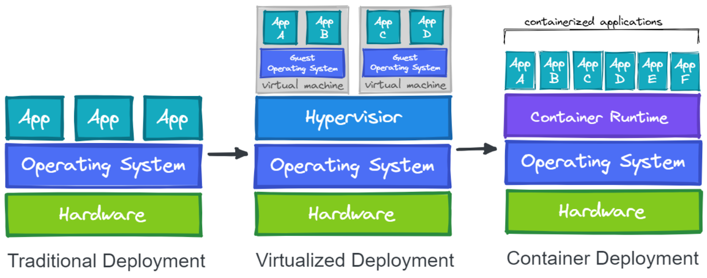

# Container Orchestration

## Container Basics (Historique)

La commande choot sur Unix depuis 1979, créait environement root et l'isolait du système de fichiers de la machine. On appelait cela chroot jail.

Les containers utilise cette technologie de façon plus moderne avec des namespace et des cgroup, en voici la liste :

    pid - process ID provides a process with its own set of process IDs.
    net - network allows the processes to have their own network stack, including the IP address.
    mnt - mount abstracts the filesystem view and manages mount points.
    ipc - inter-process communication provides separation of named shared memory segments.
    user - provides process with their own set of user IDs and group IDs.
    uts - Unix time sharing allows processes to have their own hostname and domain name.
    cgroup - a newer namespace that allows a process to have its own set of cgroup root directories.
    time - the newest namespace can be used to virtualize the clock of the system. 

## VM vs Containers

Une VM émule un système complet avec l'OS et le Kernel. Le Containers, quant à lui, partage le Kernel avec la machine hôte, ce n'est qu'un processus isolé (comme chroot)

## Podman vs Docker

Podman a les même commandes que Docker, on peut remplacer ce qu'il y a plus bas avec podman et ça marche à défaut de l'avoir installé.

On peut aller voir ce qu'il y a de disponible sur le Hub et aller le chercher ainsi

    docker run name:version

Exemple

    docker run nginx:1.20

En faisant ainsi, le processus occupe le terminal et on peut le tuer avec ctrl+c. Si on veut qui roule en background, on peut procéder ainsi

    docker run nginx:1.20 --detash --publish

On peut voir l'état de nos container avec

     docker ps

Pour l'arrêter

    docker stop ID

## Sécurité

Étant donné qu'un container partage le même Kernel que la machine hôte, il y a un risque à donné des accès root à ce container, car la machine est vulnérable. 

Il faut également faire attention avec les images publiques pour les mêmes raisons.

## Réseautage

Pour permettre les conteneurs de communiquer entre-eux dans le même hôte, ils vont être mis dans un réseau virtuel. La plupart des Overlay Network s'occupe aussi de gérer les adresses IP de tous les conteneurs.

## Service Mesh

Lorsque les conteneurs communiquent entre-eux, on veut pourvoir les monitorer, garder le contrôle d'accès et encrypter les données dans le réseau.

Il est possible d'implémenter un proxy, ce dernier va s'occuper de ça, il va s'assoir entre le client et l'application pour filtrer le traffic (exemple : nginx, haproxy, envoy)

Un service mesh va donc ajouté un proxy à CHAQUE conteneur. (exemple : istio, linkerd)

Au lieu d'implémenter un service d'encryption pour le réseau, le tout peut être régler à l'intérieur d'un fichier de config. On pourrait spécifier que Service A et B doivent toujours communiquer de façon encrypter et le service mesh s'en occupe.

## Storage

Le problème avec les conteneurs c'est qu'ils sont éphemère, à chaque fois qu'ils s'arrêtent, on perd toute la mémoire. 

Une image est en lecture seule, elle peut avoir une couche de lecture/écriture si l'application qu'elle héberge le demande.

 Pour persister les données, il faut l'écrire sur le disque de l'hôte. Cependant, en donnant accès  à un volume sur le système de fichiers de l'hôte, l'isolation du conteneur en devient plus affaiblit.
 

 Les volumes écrits doivent être accessible de n'importe quel hôte, on ne va pas démarrer le conteneur toujours à la même place. Il est donc nécéssaire d'avoir un système où stocker les données que tous les serveurs ont accès.

 ## Pour en savoir plus

 https://trainingportal.linuxfoundation.org/learn/course/kubernetes-and-cloud-native-essentials-lfs250/container-orchestration/container-orchestration?page=13
 
