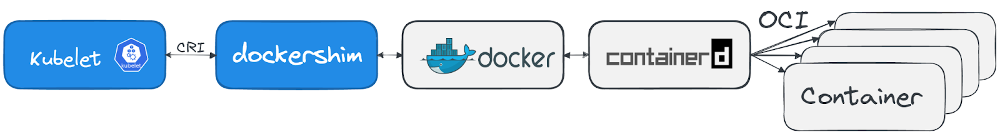

# KUBERNETES FUNDAMENTALS

[Retour](./README.md)

Il est existe 2 sortes de server node :

## Control plane node
Cerveau de l'opération, contrôle le déploiement, le scheduling et le self-healing.

### <u>kube-apiserver</u>
Pièce centrale de Kubernetes. Tous les autres composantes intéragissent avec l'api server et c'est la que les utilisateurs vont accéder au cluster.

### <u>etcd</u>
Projet base de données standalone qui contient l'état du cluster, il ne fait parti officiel de Kubernetes

### <u>kube-scheduler</u>
Il choisi un worker node qui pourra s'occuper d'une tâche schedule basé sur le CPU et la mémoire.

### <u>kube-controller-manager</u>
S'occupe de l'état du cluster, des control loops.

### <u>cloud-controller-manager(optionel)</u>
Utiliser pour intéragir avec les API des cloud provider.

## Worker nodes
C'est où les applications roulent dans le cluster. Ils n'ont aucune autres forme de logique.

### <u>container runtime</u>
S'occupe de rouler les container comme Docker et containerd

### <u>kubelet</u>
Il communique avec l'api-server pour le démarrage des containers

### <u>kube proxy</u>
S'occupe des communications interne et externe du cluster, il va utiliser le réseau de l'OS si possible.

Une application peut fonctionner sur un worker node sans controle plane, mais aucune intelligence (schedule, scallling etc) ne pourra être appliqué.

Kubernetes utilise des namespaces, à ne pas confondre avec les namespaces qui isole les conteneurs. Ces derniers devrait plus être vue comme des folder quand plusieurs équipes travaillent dans le même cluster.

## Kubernetes Setup

https://trainingportal.linuxfoundation.org/learn/course/kubernetes-and-cloud-native-essentials-lfs250/kubernetes-fundamentals/kubernetes-fundamentals?page=2

## Kubernetes API

- Authentification : Avec un certificat sign X.509
- Authorisation : Avec RBAC
- Admission Control : Pour valider les requêtes, si le registraire n'est pas reconnu, il va le bloquer.

## Running containers on Kubernetes

Kubernetes pods : Wrapper autour d'un conteneur

### Container Runtimes

containerd : Sert à rouler des conteneurs, probablement le plus populaire en ce moment

CRI-O : Créer par Red Hat, ressemble beaucoup à podman et buildah

Docker : Le plus long standard, mais n'a jamais été fait pour l'orchestration, il ne sera plus supporté par Kubernetes dès la version 1.2.3

CRI-O et containerd avait l'idée d'Avoir uniquement l'essentiel pour rouler des conteneurs. Ils ont également ajouté des outils pour les problèmes de sécurité liés au partage du Kernel comme :

gvisor : Une kernel application entre les processus du conteneur et le kernel de l'hôte

Kata Containers :  Donne une VM qui agit comme un conteneur

## Networking

Problèmes réseau rencontré

- Communication entre conteneur
- Communication entre Pod (résolu avec un overlay network)
- Communication entre Pod et service
- Communication entre Service et réseau externe

Exigences : 

- Tous les pod doivent pouvoir communiquer entre eux via les node
- Tous les nodes doivent pouvoir communiquer avec tous les pods
- Pas de NAT (Network Address Translation)

Chaque pod reçoit sa propre adresse IP

## Scheduling

Les pods sont décrit en premier et le scheduler sélectionne un node où le pod pourra être démarrer.

Il n'y a pas d'IA qui gère cela, ce sont des paramètres d'applications que Kubernetes suit (ex 2 CPU core 4 G de mémoire etc)

Le scheduler va trouver un node qui remplit les conditions

## Additional Resources

https://trainingportal.linuxfoundation.org/learn/course/kubernetes-and-cloud-native-essentials-lfs250/kubernetes-fundamentals/kubernetes-fundamentals?page=8
