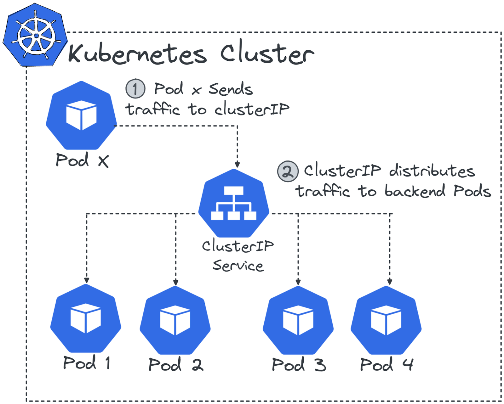
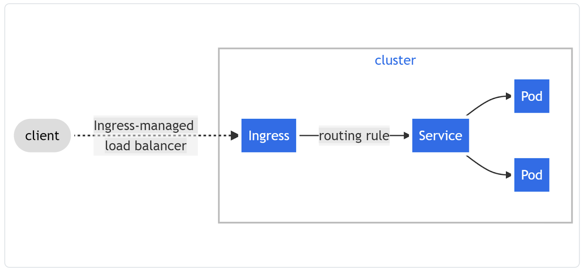

# Working with Kubernetes

[Retour](./README.md)

## Introduction

La pluspetite unité dans Kubernetes est un pod, une abstraction d'une charge de travail.

Kubernetes offre des outils pour gérer les problèmes d'orchestration, comme la configuration, le réseautage en les node, le routing du traffic externe l'équilabrage de charge ou la mise à l'échelle des pods.

## Kubernetes Objects

Kubernetes fourni des ressources abstraites (appelé objets) qui vont gérer les problèmes d'orchestrtions de conteneurs (self healing, scheduling etc...)

Nous pouvons décrire ces objets avec un fichier YAML

```yaml
apiVersion: apps/v1
kind: Deployment
metadata:
name: nginx-deployment
spec: 
selector:
    matchLabels:
    app: nginx
replicas: 2 # tells deployment to run 2 pods matching the template
template:
    metadata:
    labels:
        app: nginx
    spec:
    containers:
    - name: nginx
        image: nginx:1.19
        ports:
        - containerPort: 80
```
## Interacting with Kubernetes

La ligne de commande officiel est 

    kubectl

Elle permet de contrôler le cluster Kubernetes

La commande suivante

    $ kubectl api-resources

Affiche ceci

    NAME                    SHORTNAMES  APIVERSION  NAMESPACED  KIND
    ...
    configmaps              cm          v1          true        ConfigMap
    ...
    namespaces              ns          v1          false       Namespace
    nodes                   no          v1          false       Node
    persistentvolumeclaims  pvc         v1          true        PersistentVolumeClaim
    ...
    pods                    po          v1          true        Pod
    ...
    services                svc         v1          true        Service

kubectl possède explain, que l'on peut itiliser pour se documenter

    kubectl explain pod

Ou plus précisément

    $ kubectl explain pod.spec

### Demo kubectl

Voir le fichier de config

    kubectl config view

create a pod

    kubectl create -f pod.yaml

Voir les pods

    kubectl get pod

Supprimer un pod

    kubectl delete pod nginx

## Pod concept

L'object le plus important dans Kubernetes est un pod. Ce dernier décrit une unité de un ou plusieurs conteneurs qui ont le même cgroup et namespace. Kubernetes intéragit avec les conteneurs VIA les pods. Tous les conteneurs à l'intérieur d'un pod partage la même adresse IP


Son Yaml va ressembler à ça :

```yaml
apiVersion: v1
kind: Pod
metadata:
name: nginx-with-sidecar
spec:
containers:
- name: nginx
    image: nginx:1.19
    ports:
    - containerPort: 80
- name: count
    image: busybox:1.34
    args: [/bin/sh, -c,
            'i=0; while true; do echo "$i: $(date)"; i=$((i+1)); sleep 1; done']
initContainers:
- name: init-myservice
    image: busybox
    command: ['sh', '-c', 'until nslookup myservice; do echo waiting for myservice; sleep 2; done;']
```
sidecar container : conteneur qui supporte l'application principal qui est dans un autre conteneur

initContainers: Le conteneur qui va démarrer avant les autres

### Demo Pods

Pour rouler un conteneurs nginx dans un pods

    kubectl run nginx --image=nginx:1.19

Pour apprendre plus sur notre nouveau pod

    kubectl explain pod nginx
    kubectl describe pod nginx

Créer un pod selon un fichier YAML (comme vue ci-haut)

    kubectl -f nomFichier.yaml

## Working Objects

Travailler juste avec des pods n'est pas assez flexible, par exemple, si un node échoue, le pod est perdu pour toujours. Pour être certain que nos pods roulent toujours, on va utiliser des controller objects, envoici une liste:

- ReplicaSet : S'assure qu'un certain nombre de pod roule. Peut être utilisé pour faire de la mise à l'échelle
- Deployment :  Peut gérer plusieurs ReplicaSet pour décrire l'entiereté du cycle de vie de l'application. Mets le tout à jours lorsqu'il y a une nouvelle image.
- StatefulSet : Utiliser pour rouler des application avec un état comme des BD. Ces applications ne se marient pas bien la nature courte des pods et des conteneurs. Il essaie également de retenir les adresse IP des pods et de leur garder le même nom/stockage.
- DaemonSet : S'assure qu'une copie d'un Pod roule sur les nodes désirés, comme des outils du monitoring ou des logs.
- Job : Créer un/plusieurs pods, exécute la tâche et se termine, bon pour les courts script
- CronJob : Pareil comme Job, mais périodiquement

### Demo Workload Objects

Kubeview : Bel outil pour visualiser ce qui se passe dans le cluster

Pour scaler, ajouter 10 copies

    kubectl scale --replicas=10 rs/nginx

## Networking Objects

Nous allons utiliser des Service objects et Ingress Objects pour définir notre réseau

Service types

- ClusterIP : Peut être utiliser comme unique enpoind pour une quantité de pods. C'est le plus commun 

- NodePort : Suite du ClusterIP, il ajoute des règles de routing, il ouvre des ports sur les nodes pour les mapper avec le ClusterIP pour permettre du traffic externe.
- LoadBalancer : Suite du NodePort en déployant une instance de LoadBalancer externe.
- ExternalName : Créer des alias de DNS
  


Ingress object : Fait des routes à l'exterieur du cluster pour un service à l'intérieur du cluster.


## Using Service

Pour avoir plus d'information sur les pods, ça nous dponne entre-autre l'adresse IP que l'on peut curl pour tester

    kubectl get pods -o wide

On peut utiliser des services pour distribuer le traffic au travers les différents pods qui roulent et protéger s'il y en a un qui lâche.

    kubectl expose deployement name --port=8080

Maintenant si on fait cette commande, on va voir la liste des services

    kubectl get svc

Nous allons voir une ClusterIP, ce dernier va distribuer les requêtes qu'il reçoit vers les pods.

## Volume & Storage Objects

Kubernetes offre des solutions pour la persistance des données des conteneurs. Il a mit les volumes dans les pods. On peut le monter ainsi :

```yaml
apiVersion: v1
kind: Pod
metadata:
name: test-pd
spec:
containers:
- image: k8s.gcr.io/test-webserver
    name: test-container
    volumeMounts:
    - mountPath: /test-pd
    name: test-volume
volumes:
- name: test-volume
    hostPath:
    # directory location on host
    path: /data
    # this field is optional
    type: Directory
```


Volumes permet le partage des données entre les conteneurs d'un même pod (utile lorsqu'on a un sidecar)

Pour du volume persistant, on peut l'implémenter ainsi

```yaml
apiVersion: v1
kind: PersistentVolume
metadata:
  name: test-pv
spec:
  capacity:
    storage: 50Gi
  volumeMode: Filesystem
  accessModes:
    - ReadWriteOnce
  csi:
    driver: ebs.csi.aws.com
    volumeHandle: vol-05786ec9ec9526b67
---
apiVersion: v1
kind: PersistentVolumeClaim
metadata:
  name: ebs-claim
spec:
  accessModes:
    - ReadWriteOnce
  resources:
    requests:
      storage: 50Gi
---
apiVersion: v1
kind: Pod
metadata:
  name: app
spec:
  containers:
    - name: app
      image: centos
      command: ["/bin/sh"]
      args:
        ["-c", "while true; do echo $(date -u) >> /data/out.txt; sleep 5; done"]
      volumeMounts:
        - name: persistent-storage
          mountPath: /data
  volumes:
    - name: persistent-storage
      persistentVolumeClaim:
        claimName: ebs-claim
```


## Configuration Objects

Selon twelve factor app, il faut stocker la configuration dans l'environement. Il est considérer comme une mauvaise pratique d'incorporer la configuration dans le build du conteneur, le moindre changement obligerait un rebuild du conteneur et un redéploiement du pod. [En savoir plus](https://12factor.net/dev-prod-parity)

Dans Kubernetes uon découple la configuration des pods à l'aide d'une ConfigMap. On peut monter une configmap comme un volume dans un pod ou mapper les variables de la configmap vers les variables d'environement du Pod.

Exemple :

```yaml
apiVersion: v1
kind: ConfigMap
metadata:
  name: nginx-conf
data:
  nginx.conf: |
    user nginx;
    worker_processes 3;
    error_log /var/log/nginx/error.log;
...
      server {
          listen     80;
          server_name _;
          location / {
              root   html;
              index  index.html index.htm; } } }
```

Puis l'utiliser dans un pod

```yaml
apiVersion: v1
kind: Pod
metadata:
  name: nginx
spec:
  containers:
  - name: nginx
    image: nginx:1.19
    ports:
    - containerPort: 80
    volumeMounts:
    - mountPath: /etc/nginx
      name: nginx-conf
  volumes:
  - name: nginx-conf
    configMap:
      name: nginx-conf
```

Kubernetes utilise des secret encodé en base64, ils ne sont pas ce qu'il y a de plus sécuritaire, alors il est mieux d'utiliser un service tier comme Hashicorp Vault ou Azure Vault qui se marie bien avec K8s...

## Autoscaling Objects

On peut utiliser 3 différents Autoscaling Mechanisms

- Horizontal Pod Autoscaler (HPA) :  Le plus utilisé, il augmente le nombre de replicas selon un treshold donné. Par exemple, un Pod de 500mb avec un treshold de 80%, l'autoscale va créer une nouvelle replicas
- Cluster Autoscaler : Travaille en tandem avec HPA, il va ajouter des worker nodes au cluster si la demande augmente.
- Vertical Pod Autoscaler : Limité par la capacité du node, il augmente les ressources du Pod si la demande augmente

HPA demande un partie tierce pour pouvoir fonctionner : [metrics-server](https://github.com/kubernetes-sigs/metrics-server)


[Prometheus-adapter](https://github.com/kubernetes-sigs/prometheus-adapter) est un outil qui aide à scaler avec des métriques personnalisées.

## Additional Resources

[Cliquez ici](https://trainingportal.linuxfoundation.org/learn/course/kubernetes-and-cloud-native-essentials-lfs250/working-with-kubernetes/working-with-kubernetes?page=13)
