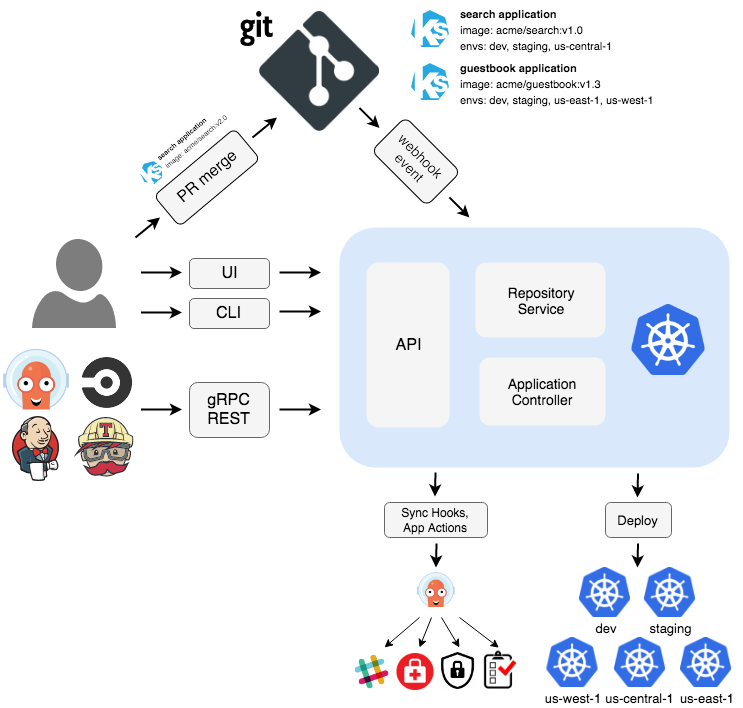

# Cloud Native Application Delivery

[Retour](./README.md)

## CI/CD

Continuous Integration est le build et le test permanent du code. Cela permet à plusieurs développeur d'être sur le même projet.

Continuous Delivery est la deuxième partie du processus, il automatise le déploiement du logiciel pre-build, il va souvent être déployer en staging avant d'être en production.

On peut le scripter avec ce qu'on appel une CI/CD pipeline

[Pour en savoir plus](https://training.linuxfoundation.org/training/introduction-to-devops-and-site-reliability-engineering-lfs162/)

## GitOps

GitOps prend l'idée que Git est la single source of truth et applique des opérations de version control dessus. 

Deux type d'approche CI/CD

- Push-based : Changement activé via un commit ou une merge request
- Pull-based : Un agent regarde le repo pour des changements, s'il y en a de détecté, l'agent les applique.

ArgoCD est pull based

## Additional Resources

https://trainingportal.linuxfoundation.org/learn/course/kubernetes-and-cloud-native-essentials-lfs250/cloud-native-application-delivery/cloud-native-application-delivery?page=4
