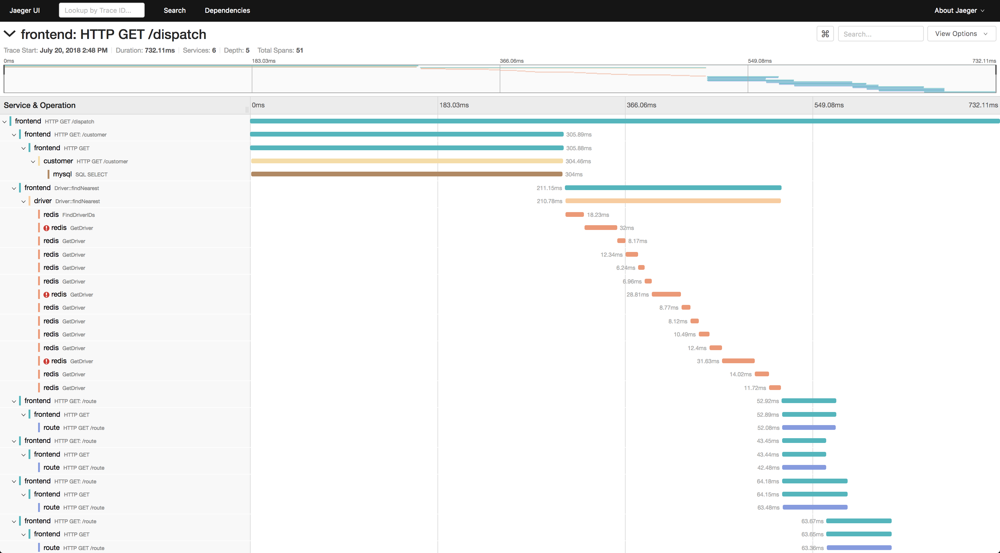

# Cloud Native Architecture

[Retour](./README.md)

## Observability

Le therme est très près de control theory qui stipule qu'on peut changer le comportement d'un système selon des métriques externes (exemple cruise control). En faisant cela, on veut pouvoir continuer d'observer notre cluster et les intéractions entre les pods.

## Telemetry

Mesure et collecte des données et les transfère à un autre système. C'est pratique pour avoir des logs, des métriques et des traces centraliser au même endroit. Dans un système où il y a plusieurs services, vérifier des logs directements dans les fichiers respectifs peut être fastidieux.

## Logging

docker, kubectl et podman fournissent une commande pour visualiser les logs des processus des conteneurs dans /dev/stdout et /dev/stderr

le paramètre <b>-f</b> permet de stream les logs en temp réel.

### Pour un interraction directe

Voici quelques exemples de lignes de commande:

- Avoir les logs du pod nginx

        kubectl logs nginx 

- Retourne le conteneur ruby du pod web-1 précédent

        kubectl logs -p -c ruby web-1 

- Pareil, mais en temps réel

        kubectl logs -f -c ruby web-1 

- Affiche les 20 dernières lignes du pod nginx

        kubectl logs --tail=20 nginx 

- Affiche tous les logs de la dernière heure de nginx

        kubectl logs --since=1h nginx

### Pour gérer beaucoup de données

Node-level logging : Efficace, un admin configure un outil qui va centraliser les logs

Logging via sidecar container : L'application a un sidecar container qui collecte les données, puis les envoies à un dépôt centralisé.

Application-level logging : L'application s'occupe d'envoyer les logs dans le dépôt centralisé, cependant, pour se faire, il faut configurer un adaptateur de logging dans CHAQUE application.

Pour une liste d'outil [c'est par ici](https://www.fluentd.org/dataoutputs)

Chez Devolutions, on utilise datadog.

## Prometheus

Un outil open source pour faire du monitoring, il s'intègre bien avec Kubernetes. Il utilise 4 métriques différentes : 

- Counter : Valeur incrémentale, compteur d'erreur ou de requête.
- Gauge : Valeur qui peut monter ou baisser, comme la mémoire utilisée.
- Histogram : Échantillon d'observation, comme la durée d'une requête, ou la grosseur de la réponse.
- Summary : Semblable à l'histogram, mais fourni également le compte des observations

## Tracing

Une trace est le chemin que va emprunter une requête, elle va laisser des informations.

## Cost Management

Pour bien gérer les coûts, il est important d'analyser ce qui est réellement nécessaire et, si possible, automatiser certaines ressources.

### Optimisation

- Identifier les ressources inutilisées et ainsi fermer les instances qu'on n'utilise pas. L'autoscalling peut être pratique à ce moment.
- Au début, il est bon de prévoir beaucoup de puissance, mais après coup, il faut réajuster. En gros, ne pas acheter de grosses machines si on n'utilise que la moitié
- Reserved instances : Les services "Sur demande" sont pratique, mais ont un coût. Si c'est possible, il est bien de prévoir à l'avance les ressources qui vont être nécessaire et les payer d'avance.
- Spot Instances : Semblable au Reserved Instances, cependant, le coût est moindre, mais les instances ne sont pas réservé, alors on peut les perdre à court préavis.

## Additional resources

[Cliquez ici](https://trainingportal.linuxfoundation.org/learn/course/kubernetes-and-cloud-native-essentials-lfs250/cloud-native-observability/cloud-native-observability?page=7)
