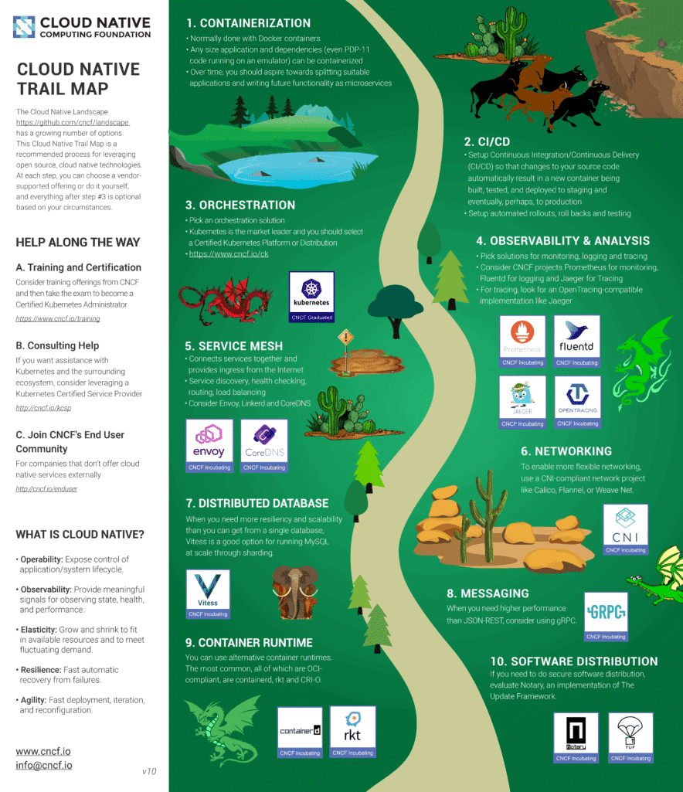
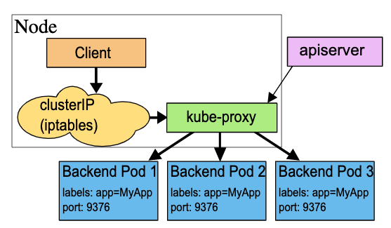

# Udemy retour sur deuxième examen

[Retour](./README.md)

## Argo vs Flux CD

Flux et Argo sont un set de solution au déploiement continue et progressif. Il sont builder en utilisant le toolkit GitOps.

La différence entre ces deux est que Argo est push-based et Flux et pull-based.

## Namespace

Kubernetes commence avec 4 namespaces initiaux

- default
- kube-public
- kube-system
- kube-node-lease

## Harbor

Il est le projet CNCF dominant pour les container registries

## Cloud Native Trail Map

 

## Kubernetes Autoscalling

- Horizontal Pod Autoscaler
- Vertical Pod Autoscaler
- Cluster Autoscaler

## Labels

Dans Kubernetes, les labels servent à assigner une key-value à un objet comme un pod.

 

## Kubernetes Service Type

Permet de spécifier quel genre de service on veut.

- ClusterIP (Par défaut)
- NodePort
- LoadBalancer
- ExternalName

## 3 élément de télémétrie de données typique

- Métriques
- Logs
- Traces

## Runtime Class

C'est une feature pour sélectionner les configuration de runtime. Il est utiliser pour rouler un conteneur dans un pod.

## Semantic Versioning

Majeur.Mineur.Patch

## Note

- Rolling update permet de mettre des déploiement à jours sans downtime

- Un volume persistant peut être provisionné par un administrateur ou de façon dynamique par une Storage Classes

- Pour request du storage dans Kubernetes on utilise PersistantVolumeClaim 'PVC'

- Kubernetes Operations (kops)

- Open Policy Agent (OPA)

- Un workload est une application qui roule sur Kubernetes

- Pour se log dans un pod

        kubectl exec

- Utiliser des instances réservées est le meilleur moyen d'obtenir optimisation du prix dans un environement de cloud

- Retourne tous les pod dans un format JSON

        kubectl get pods -o json

